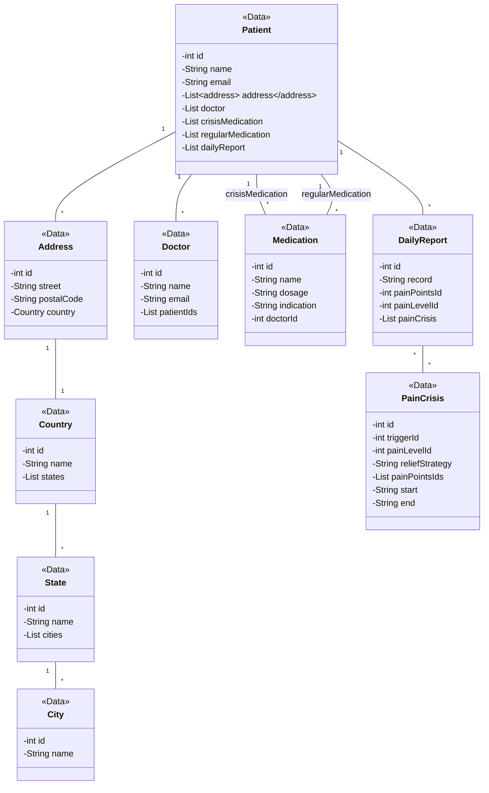

## Daily Pain API
# Class Diagram

```mermaid
classDiagram
    class Patient {
        <<Data>>
        -int id
        -String name
        -String email
        -List<Address> address
        -List<Doctor> doctor
        -List<Medication> crisisMedication
        -List<Medication> regularMedication
        -List<DailyReport> dailyReport
    }

    class Address {
        <<Data>>
        -int id
        -String street
        -String postalCode
        -Country country
    }

    class Country {
        <<Data>>
        -int id
        -String name
        -List<State> states
    }

    class State {
        <<Data>>
        -int id
        -String name
        -List<City> cities
    }

    class City {
        <<Data>>
        -int id
        -String name
    }

    class Doctor {
        <<Data>>
        -int id
        -String name
        -String email
        -List<int> patientIds
    }

    class Medication {
        <<Data>>
        -int id
        -String name
        -String dosage
        -String indication
        -int doctorId
    }

    class DailyReport {
        <<Data>>
        -int id
        -String record
        -int painPointsId
        -int painLevelId
        -List<PainCrisis> painCrisis
    }

    class PainCrisis {
        <<Data>>
        -int id
        -int triggerId
        -int painLevelId
        -String reliefStrategy
        -List<int> painPointsIds
        -String start
        -String end
    }

    Patient "1" -- "*" Address
    Address "1" -- "1" Country
    Country "1" -- "*" State
    State "1" -- "*" City
    Patient "1" -- "*" Doctor
    Patient "1" -- "*" Medication: crisisMedication
    Patient "1" -- "*" Medication: regularMedication
    Patient "1" -- "*" DailyReport
    DailyReport "*" -- "*" PainCrisis

```